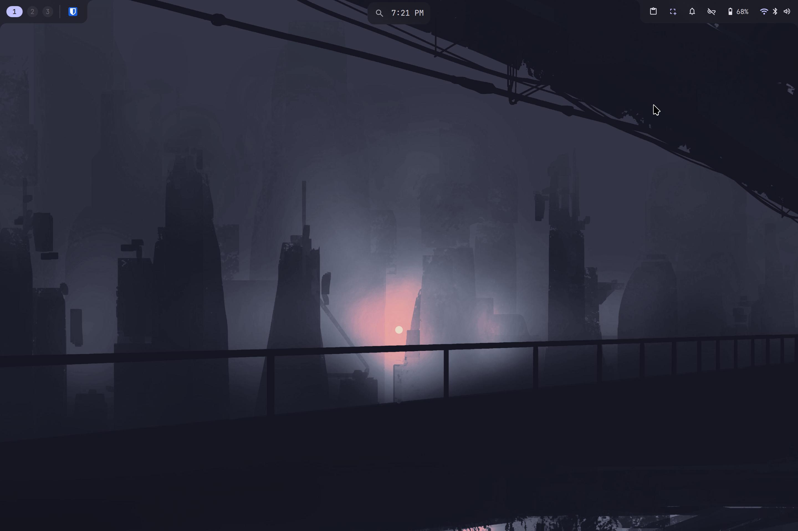
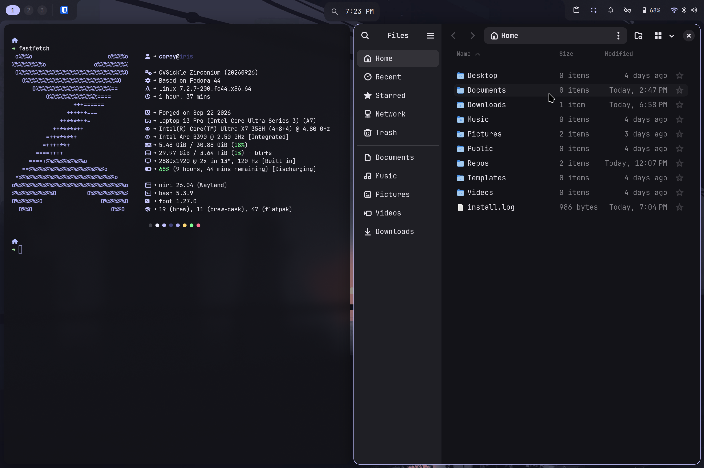
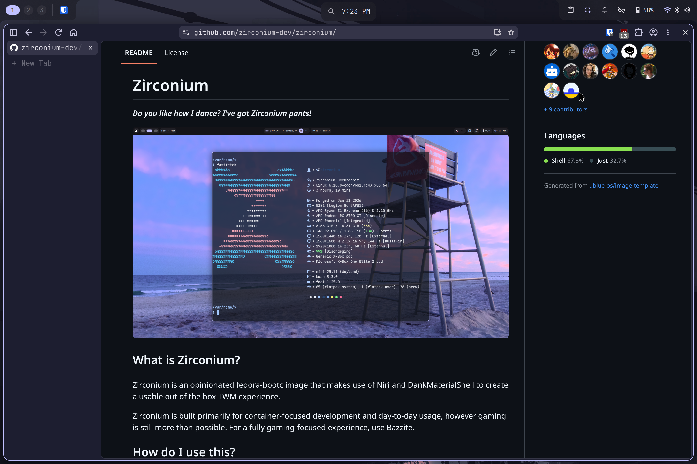

# Zirconium

[](https://github.com/cvsickle/zirconium/actions/workflows/build.yml) &nbsp; [](https://github.com/cvsickle/zirconium/actions/workflows/dependabot/dependabot-updates) &nbsp; [](https://github.com/cvsickle/zirconium/actions/workflows/renovate.yml) &nbsp; [](https://github.com/cvsickle/zirconium/actions/workflows/sync_codeberg.yaml)

---

This repository is a custom [bootc](https://github.com/bootc-dev/bootc) image built on [Zirconium](https://github.com/zirconium-dev/zirconium).

It was created using the [BlueBuild Workshop](https://workshop.blue-build.org/).

 &nbsp;  &nbsp; 

> Wallpaper from [orangci](https://github.com/orangci/walls-catppuccin-mocha).

## Changes made

### System packages added

#### Usability

- Multimedia Codecs
- Nerd Fonts from [ryanoasis/nerd-fonts](https://github.com/ryanoasis/nerd-fonts)
- [podman-docker](https://github.com/podman-container-tools/podman/blob/main/docker/podman-docker.sh)
- [Podman Compose](https://github.com/containers/podman-compose)
- [GitHub CLI](https://cli.github.com/)
- [Git Credential Manager](https://github.com/git-ecosystem/git-credential-manager)
- [Oniri](https://github.com/Antiz96/oniri)
  - See [docs/niri](./docs/niri.md) for setup info.
- Swapped `tuned-ppd` for `power-profiles-daemon`
  - See the [Phoronix writeup](https://www.phoronix.com/review/fedora-pantherlake-thermald-tuned) for info.

#### Applications

- [Tailscale](https://tailscale.com/)
  - See [docs/tailscale](./docs/tailscale.md) for setup info.
- Everything needed for [LazyVim](https://github.com/lazyvim/lazyvim)
  - [Neovim](https://github.com/neovim/neovim)
  - [LazyGit](https://github.com/jesseduffield/lazygit)
  - Etc.
- [starship](https://github.com/starship/starship)
- [Helium Browser](https://github.com/imputnet/helium)
- [VS Code](https://github.com/microsoft/vscode)
- [File Roller](https://gitlab.gnome.org/GNOME/file-roller)

### System packages removed

- fcitx5
- hyfetch
- valent

### Brew

- [Bold Brew](https://github.com/Valkyrie00/bold-brew)
- [Dev Container CLI](https://github.com/devcontainers/cli)
- [LazyDocker](https://github.com/jesseduffield/lazydocker)

### Flatpak

- [Easy Effects](https://flathub.org/en/apps/com.github.wwmm.easyeffects)
- [Flatseal](https://flathub.org/en/apps/com.github.tchx84.Flatseal)
- [Gear Lever](https://flathub.org/en/apps/it.mijorus.gearlever)
- [LocalSend](https://flathub.org/en/apps/org.localsend.localsend_app)
  - See [docs/localsend](./docs/localsend.md) for firewall information.
- [Podman Desktop](https://flathub.org/en/apps/io.podman_desktop.PodmanDesktop)
- [SiriKali](https://flathub.org/en/apps/io.github.mhogomchungu.sirikali)
- [Web Apps](https://flathub.org/en/apps/net.codelogistics.webapps)

## Installation

Here is the recommened installation process.

- Flash the Zirconium ISO from the project's [GitHub](https://isos.zirconium.gay/zirconium-isos/zirconium-amd64.iso) onto a USB.
- Boot from the USB and install Zirconium.
- Boot into Zirconium.

> [!TIP]
> This process should work from any Fedora-based bootc image.

- Once in a bootc system, switch to this image.

```bash
# Normal image
sudo bootc switch ghcr.io/cvsickle/zirconium:latest
# Nvidia image
sudo bootc switch ghcr.io/cvsickle/zirconium-nvidia:latest

# Reboot when done.
systemctl reboot
```

- Once booted into this image, enable signing verification.

```bash
# Normal image
sudo bootc switch --enforce-container-sigpolicy ghcr.io/cvsickle/zirconium:latest
# Nvidia image
sudo bootc switch --enforce-container-sigpolicy ghcr.io/cvsickle/zirconium-nvidia:latest
```

- If the boot loader menu entries are still showing the upstream image name, force them to update. Unfortunately, this is only a one-time fix. I'm still researching why this happens sometimes.

```bash
sudo rpm-ostree kargs --append=bls.refresh=1
systemctl reboot
```

## Verification

These images are signed with [Sigstore](https://www.sigstore.dev/)'s [cosign](https://github.com/sigstore/cosign). You can verify the signature by downloading the `cosign.pub` file from this repo and running the following command:

```bash
cosign verify --key cosign.pub ghcr.io/cvsickle/zirconium
```

## Repository Mirrors

- GitHub - [https://github.com/cvsickle/zirconium](https://github.com/cvsickle/zirconium)
- Codeberg - [https://codeberg.org/cvsickle/zirconium](https://codeberg.org/cvsickle/zirconium)
- Forgejo (Mirror) - [https://git.cvsickle.com/cvsickle/zirconium](https://git.cvsickle.com/cvsickle/zirconium)

## Other custom OS images

- [Bazzite DX](https://github.com/cvsickle/bazzite-dx)
- [Bluefin DX](https://github.com/cvsickle/bluefin-dx)
- [Entrypoint](https://github.com/cvsickle/entrypoint)
